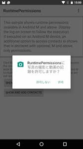

### エンジニアが学ばないとこうなります@Android
 

 
 
　　　　　　　　　　　　　Naoki Takimoto
---
今日話すこと
 

* 学ばなくて起きた障害
  * Android開発をやってきての経験
* 実際に自分が行っていること
  * （できれば）皆さんのも教えてほしい

---
### まずはじめに

---
### このブログ見たことありますか？

---

---

---

---
何とかなりそうな理由
 

* 環境構築は手順書に従うだけ
* 既存コードを流用（コピペ）
* 分からない部分はGoogleに聞けばいい

---
### 本当にそうなのか？

---
### いや、何とかなりません！！！ （Androidの場合は）

---
何とかならない理由
 

* OSなど環境を開発者は選べない
  * OSアップデートはユーザに委ねられる
  * 端末はメーカーが仕様を決めて発売される
* アプリが動かなくなるのはアプリのバージョンアップに関わらず起こる

---
何とかならない要因
 

* Android OSアップデートがある
* 新しい端末が常に出る
* Googleの方針転換

---
何とかならない要因
 

* <bold style="color: #FF9800;">Android OSアップデートがある</bold>
* 新しい端末が常に出る
* Googleの方針転換

---
Android OSアップデート
 

* 年に1回ある
* OSアップデートはユーザが任意で行う
* アプリはそれに従うだけ

---
### 実例 Runtime Permission問題 (2015年)

---
ある機能が突然使えなくなった
 

* Bluetooth通信を使用している機能が使えない
* クラッシュ・エラーメッセージもなし
* Android 6の端末で起こっている

---
### ？？？

---
Runtime Permission
 

* Android 6で導入
* アプリのアクセス権限の許可/拒否をユーザーが自由に選択可能
* 機能の実行時に権限を確認するように変更
  * 以前はインストール時にすべての権限を確認していた

---
Android 5まで
 

---
Android 6以降
 

---
Runtime Permission
 

* アクセス権限の承諾の処理はアプリで実装しなければならない
  * 処理を追加しなければ、アクセスできなくなる
* アクセスを拒否されたときの考慮がアプリで必要
  * エラー画面を出すなど

---
### これ事前に知らないと対処できませんよね

---
こうならないために
 

* Google Developer Blogを見る
* Beta版での検証を行う
  * エミュレータ or 実機で

---
何とかならない要因
 

* Android OSアップデートがある
* <bold style="color: #FF9800;">新しい端末が常に出る</bold>
* Googleの方針転換

---
新しい端末が常に出る
 

* メーカーによって端末スペックが様々
  * ディスプレイサイズ、解像度など
* メーカー独自の機能もある
* アプリはそれに従うだけ

---
### 実例 面アスペクト比2:1問題 (2017年)

---
ある端末でレイアウトが崩れる
 

* なぜか下に黒い余白がある
* 特定端末だけに起こる

---
### あれ？縦に長くないか！？

---
画面アスペクト比2:1端末
 

* 2017年夏モデルくらいから
  * Galaxy S8/S8+
* 従来は16:9でずっと作られていた
* Maxアスペクト比の設定をしないと黒い余白ができる

---
### これ事前に知らないと対処できませんよね

---
こうならないために
 

* Google Developer Blogを見る
* メーカーの発売情報をチェックする

---
何とかならない要因
 

* Android OSアップデートがある
* 新しい端末が常に出る
* <bold style="color: #FF9800;">Googleの方針転換</bold>

---
#### ありがとうございました

