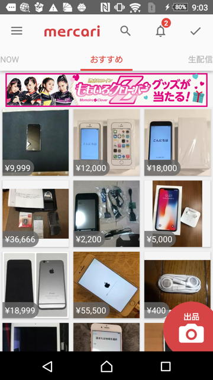

### エンジニアが学ばないと こういうことが起こりました@Android
 

 
　　　　　　　　　　　　　Naoki Takimoto
---
今日話すこと
 

* 学ばなかった・知らなかったことで起きた障害
  * Android開発で遭遇した事例も含め
* 自分が行っている情報収集
  * （できれば）皆さんのも教えてほしい

---
### まずはじめに

---
### このブログ見たことありますか？

---

https://axia.co.jp/2017-07-18

---

---

---
何とかなりそうな理由
 

* 環境構築は手順書に従うだけでOK
* 既存コードを流用（コピペ）
* 分からない部分はGoogleに聞けばいい

---
### 本当にそうなのか？

---
### いや、何とかなりません！！！ （少なくともAndroidの場合は）

---
何とかならない理由
 

* アプリはOSなど環境を開発者は選べない
  * OSアップデートはユーザに委ねられる
  * 端末はメーカーが仕様を決めて発売される
* アプリのバージョンアップに関わらず、アプリが動かなくなる場合がある

---
何とかならない要因
 

* Android OSアップデートがある
* 新しい端末が常に出る
* Googleの方針転換

---
何とかならない要因
 

* <bold style="color: #FF9800;">Android OSアップデートがある</bold>
* 新しい端末が常に出る
* Googleの方針転換

---
Android OSアップデート
 

* 年に1回ある(8,9月)
* OSアップデートはユーザが任意で行う
* メーカー側の検証後にOSアップデートが行われるため、リリースされるのは3,4ヶ月はかかる

---
### 実例）Runtime Permission問題 (2015年)

---
ある機能が突然使えなくなった
 

* Bluetooth通信を使用している機能が使えない
* クラッシュ・エラーメッセージもなし
* Android 6の端末で起こっている

---
### ？？？

---
Runtime Permission
 

* Android 6で導入
* アプリのアクセス権限の許可/拒否をユーザーが自由に選択可能
* 機能の実行時に権限を確認するように変更
  * 以前はインストール時にすべての権限を確認していた

---
Android 5まで
 

---
Android 6以降
 

---
Runtime Permission
 

* アクセス権限の承諾処理はアプリ側で実装しなければならない
  * 処理を追加しなければ、アクセスできなくなる
* アクセスを拒否されたときの考慮がアプリで必要
  * エラー画面を出すなど

---
#### これ事前に知らないと対処できませんよね

---
こうならないために
 

* Google Developer Blogを見る
* Beta版での検証を行う
  * エミュレータ or 実機で

---
何とかならない要因
 

* Android OSアップデートがある
* <bold style="color: #FF9800;">新しい端末が常に出る</bold>
* Googleの方針転換

---
新しい端末が常に出る
 

* だいたい年に2回ある
* メーカーによって端末スペックが様々
  * ディスプレイサイズ、解像度など
* メーカー独自の機能もある
  * Galaxy Edge, ナビゲーションバーの表示・非表示

---
### 実例）画面アスペクト比2:1問題 (2017年)

---
ある端末でレイアウトが崩れる
 

* なぜか下に黒い余白がある
* 特定端末だけに起こる

---
これが

---
こうなった

---
#### あれ？この端末、縦に長くないか！？

---
画面アスペクト比2:1端末
 

* 2017年夏モデルくらいから
  * Galaxy S8/S8+など現在10機種くらい
* 従来は16:9でずっと作られていた
* Maxアスペクト比の設定をしないと黒い余白ができる

---
#### これ事前に知らないと対処できませんよね

---
こうならないために
 

* Google Developer Blogを見る
* メーカーの発売情報をチェックする

---
何とかならない要因
 

* Android OSアップデートがある
* 新しい端末が常に出る
* <bold style="color: #FF9800;">Googleの方針転換</bold>

---
Googleの方針転換
 

* OSアップデートのタイミングでGoogle非推奨のAPIが出てくる
* 非推奨のAPIはそのうち削除される
* そのタイミングはすべてGoogle次第

---
### 実例）Volley問題(2015年)

---
Volley
 

* 2013年頃に出たネットワークライブラリ
* Google社員が作った
* Googleによる検証で最速の通信ライブラリ

---
### Android 6で非推奨となる

---
Volleyの問題
 

* VolleyはHttpClientを使っていた
* HttpClientにはいつくかのバグがあった
  * Android 5.1で非推奨
  * Android 6でHttpClientが削除される
* それに伴い、Volleyが非推奨(OSS開発もストップ)

---
#### これを知らずに使い続けると・・・

---
### ここまでまとめ

---
まとめ
 

* 知らないと何とかならないことはある
* 事前に知らないことが障害につながる
  * ググって解決できても、1発目の障害を防ぐことはできない
* 逆を言えば、知っているだけでいい
  * すべてを理解している必要はない
  * 実際に使うときにググればいい

---
#### 知っていてうまくいったケース

---
### 言いたいことは

---
### 新しい情報を常に取り入れるようにしましょう

---
### 自分が行っている情報収集

---
ニュースサイトを見る
 

* Google Developer Blog
https://developers.googleblog.com/
* Tech Crunch
http://jp.techcrunch.com/
* juggly.cn
http://juggly.cn/
* Engadget
http://japanese.engadget.com/tag/android/

---
技術ブログを見る
 

* クックパッド開発者ブログ
http://techlife.cookpad.com/
* ペパボ テックブログ
https://tech.pepabo.com/
* eureka tech blog
https://developers.eure.jp/
* connehito Engineer's Blog
http://tech.connehito.com/

---
勉強会へ参加
 

* ユーザグループ主催
  * Android Bazaar and Conference, DevFest Tokyo
* 企業主催
  * LINE DEVELOPER DAY, Developers Summit, MANABIYA -teratail Developer Days-
* イベントやIT勉強会支援プラットフォーム
  * Conpass, Tech Play, Doorkeeper, ATND

---
SNSの活用
 

* Twitter
  * 勉強会に登壇している人をフォロー
* Slack
  * モヒカンslack
  https://gist.github.com/kotakanbe/e4232407b75e1ec584e7

---
#### 最後に

---
#### 皆さん、どうやって情報収集していますか？

---
ブレストメモ
 
* 自分の知り合い・研究室の先輩から教えてもらったサイトを見る（masaki）
* やっていることは分類分けすると4つ（石川）
  * 海外サイトを翻訳しているメディア
  * 企業のパブリックなアウトプット
    * この企業ならこの分野に強いなど紐付けてもいる
  * 自分が好きな人の記事
  * クローリングしてくれるまとめサイト

---
ブレストメモ
 
* 知らない話を聞いたら、後から調べる(古澤)
* Qiitaの新着、人気記事を見る(花岡, keisuke)
* 本のつまみ読みをする(星)
  * 使いそうな内容のところだけをページの角を折る
* ライブラリのコードを読む

---
ブレストメモ
 

* ニュースサイト
  * Publickey
  http://www.publickey1.jp/
  * POSTD
  http://postd.cc/

* モヒカンslack
  https://gist.github.com/kotakanbe/e4232407b75e1ec584e7
  * #lang-php
  * #slide_design系
  * #blog-ja

---
ブレストメモ
 

* 技術ブログ
  * クラスメソッド
  https://dev.classmethod.jp/
  * 徳丸浩の日記
  https://blog.tokumaru.org/
  * hidekatsu-izuno 日々の記録
  http://hidekatsu-izuno.hatenablog.com/
  * 津島博士のパフォーマンス講座
  http://www.oracle.com/technetwork/jp/database/articles/tsushima/index.html

---
#### ありがとうございました

